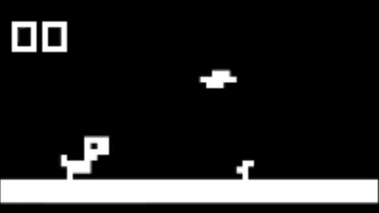
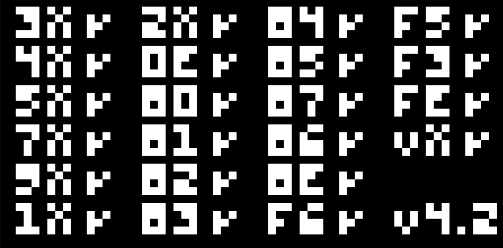

# CHIP-8 Emulator
[](https://github.com/lukedholder/CHIP-8-emulator/actions/workflows/ci.yml)



A CHIP-8 interpreter written from hardware documentation in C++20, using SDL2 for
video, input, and audio. Includes a built-in disassembler and step debugger.

CHIP-8 is an interpreted virtual machine from 1977, designed so hobbyists could
write games once and run them on different microcomputers. This project implements
the full instruction set from the original specification rather than porting an
existing interpreter.

## Features

- **Complete instruction set**: all 35 opcodes, validated against the Timendus test suite
- **Configurable quirk profiles**: COSMAC VIP or SUPER-CHIP behaviour for the ambiguous instructions
- **Accurate timing**: a fixed-timestep loop keeps the 60 Hz timers exact and independent of a configurable CPU speed
- **Sound**: square-wave beeper generated in SDL's audio callback
- **Built-in debugger**: pause, single-step, live disassembly, and register dumps
- **Tested**: unit tests with Catch2 covering instruction semantics and quirk behaviour

## Building

Requires a C++20 compiler, [CMake](https://cmake.org/) 3.21+, and SDL2.
The instructions below use [vcpkg](https://vcpkg.io/) to supply SDL2.

```bash
vcpkg install sdl2
```

```bash
cmake -B build -S . -DCMAKE_TOOLCHAIN_FILE=<path-to-vcpkg>/scripts/buildsystems/vcpkg.cmake
```

```bash
cmake --build build --config Debug
```

The binary is written to `build/Debug/chip8.exe` on Windows, or `build/chip8`
elsewhere.

Catch2 is only needed for the test target. If it is not already installed, CMake
downloads a pinned copy automatically, so no extra step is required. To install it
locally instead:

```bash
vcpkg install catch2
```

### Running the tests

```bash
ctest --test-dir build -C Debug --output-on-failure
```

## Usage

```
chip8.exe <rom-file> [cycles-per-second] [--schip] [--pause]
```

| Argument | Description |
| --- | --- |
| `<rom-file>` | Path to a `.ch8` ROM image. Required. |
| `cycles-per-second` | CPU speed. Defaults to 700. Most ROMs work between 500 and 1000. |
| `--schip` | Use the SUPER-CHIP quirk profile instead of COSMAC VIP. |
| `--pause` | Start paused at the first instruction, for stepping from entry. |

Arguments after the ROM path may appear in any order.

Playable games are bundled under `roms/Chip8/`, and the Timendus test suite
under `roms/bin/`.

```bash
./build/Debug/chip8.exe roms/Chip8/dinorun.ch8
```

```bash
./build/Debug/chip8.exe roms/bin/2-ibm-logo.ch8 --pause
```

## Controls

The original hardware used a 16-key hexadecimal keypad, mapped here onto the
left-hand block of the keyboard so the physical layout is preserved:

```
 CHIP-8 keypad        Keyboard
 ┌───┬───┬───┬───┐   ┌───┬───┬───┬───┐
 │ 1 │ 2 │ 3 │ C │   │ 1 │ 2 │ 3 │ 4 │
 ├───┼───┼───┼───┤   ├───┼───┼───┼───┤
 │ 4 │ 5 │ 6 │ D │   │ Q │ W │ E │ R │
 ├───┼───┼───┼───┤ → ├───┼───┼───┼───┤
 │ 7 │ 8 │ 9 │ E │   │ A │ S │ D │ F │
 ├───┼───┼───┼───┤   ├───┼───┼───┼───┤
 │ A │ 0 │ B │ F │   │ Z │ X │ C │ V │
 └───┴───┴───┴───┘   └───┴───┴───┴───┘
```

Keys are read by physical position (SDL scancodes), so the same block is used
regardless of keyboard layout.

| Key | Action |
| --- | --- |
| `F1` | Pause / resume |
| `F2` | Step one instruction (while paused) and print its disassembly |
| `F3` | Print registers, index, stack pointer, and timers |
| `Esc` | Quit |

Stepping prints the address, the raw opcode, and the decoded instruction:

```
200: 00E0  CLS
202: A22A  LD    I, 22A
204: 600C  LD    V0, 0C
206: 6108  LD    V1, 08
208: D01F  DRW   V0, V1, F
20A: 7009  ADD   V0, 09
```

## Correctness

Verified against [Timendus' CHIP-8 test suite](https://github.com/Timendus/chip8-test-suite),
included under `roms/bin/`:

| Test ROM | Result |
| --- | --- |
| `1-chip8-logo` | Passes |
| `2-ibm-logo` | Passes |
| `3-corax+` | 22 / 22 opcode checks pass |
| `4-flags` | 45 / 45 flag checks pass |
| `6-keypad` | Passes all three sections |
| `7-beep` | Passes |
| `5-quirks` | Reports behaviour matching the selected profile |
| `8-scrolling` | Not supported — requires SUPER-CHIP display modes |



### Quirks

CHIP-8 was never formally standardised, and several instructions behave
differently between the original COSMAC VIP interpreter and the later SUPER-CHIP
implementation. ROMs depend on whichever their author developed against, so both
are supported and selectable at runtime.

| Instruction | COSMAC VIP (default) | SUPER-CHIP (`--schip`) |
| --- | --- | --- |
| `8XY6` / `8XYE` | Shift `VY` into `VX` | Shift `VX`, ignore `VY` |
| `FX55` / `FX65` | `I` advances by `X+1` | `I` is left unchanged |
| `BNNN` | Jump to `NNN + V0` | Jump to `XNN + VX` |
| `8XY1` / `8XY2` / `8XY3` | `VF` is reset to zero | `VF` is untouched |

The default is the COSMAC VIP profile, which matches most ROMs on the
[CHIP-8 Archive](https://johnearnest.github.io/chip8Archive/). Each entry there
lists the platform it targets; use `--schip` for those that expect SUPER-CHIP
behaviour.

Note that this is a quirk profile only. The SUPER-CHIP *instruction set*
extensions (the 128×64 display mode and the scroll opcodes) are not implemented,
so ROMs requiring them will not run.

## Implementation notes

**The emulator core has no SDL dependency.** `chip8core` contains only the CPU,
memory, and disassembler; SDL lives entirely in the `Platform` class behind it.
This is enforced by the build system rather than by convention, which means the
interpreter can be driven headlessly by the test suite with no display, no audio
device, and no event loop.

**Timing uses a fixed-timestep accumulator rather than a frame delay.** Elapsed
wall-clock time is measured with `std::chrono::steady_clock` and spent in
fixed-size chunks, so the timers tick exactly 60 times per second regardless of
how irregular frame times are, and the CPU rate stays independent of the display
rate. Elapsed time is clamped to 250 ms so that a long stall (dragging the
window, or pausing in a debugger) cannot trigger a runaway catch-up loop.

**The framebuffer stores 32-bit pixels rather than bits.** A monochrome 64×32
display needs only 2048 bits, but storing each pixel in the format SDL expects
means a frame is uploaded with a single `SDL_UpdateTexture` call and no
conversion pass. That trades roughly 8 KB of memory for a render path with no
per-pixel work.

**All memory access is masked to 12 bits.** CHIP-8 addresses are 12 bits wide, so
masking every read and write makes out-of-bounds access impossible while
reproducing the address wrapping of the original hardware.

**SDL resources are managed by RAII.** The `Platform` class acquires the window,
renderer, texture, and audio device in its constructor and releases them in its
destructor, with copying deleted so the handles cannot be double-freed.

## Project layout

```
src/
  chip8.cpp/.hpp     CPU, memory, and instruction dispatch
  disasm.cpp/.hpp    Opcode disassembler
  platform.cpp/.hpp  SDL window, renderer, input, and audio
  main.cpp           Argument parsing, timing loop, debugger controls
tests/
  test_chip8.cpp     Catch2 unit tests
roms/
  Chip8/             playable games
  bin/               Timendus test suite (.ch8 binaries and .8o sources)
```

## Credits

- [Cowgod's CHIP-8 Technical Reference](http://devernay.free.fr/hacks/chip8/C8TECH10.HTM) — the instruction set specification
- [Timendus' CHIP-8 Test Suite](https://github.com/Timendus/chip8-test-suite) — conformance test ROMs, included under `roms/bin/`
- [CHIP-8 Archive](https://johnearnest.github.io/chip8Archive/) — the games used for testing
- [Simple DirectMedia Layer](https://www.libsdl.org/) — video, input, and audio

## License

Released under the MIT License. See [LICENSE](LICENSE).
